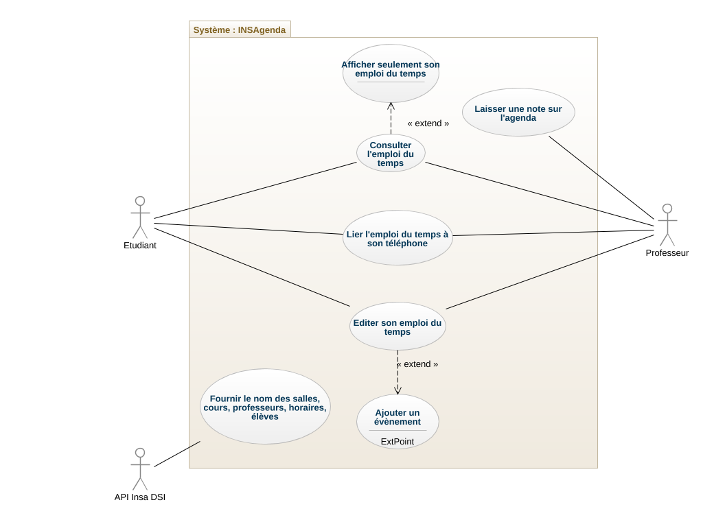

# I	Fondements du projet
## 1. But du projet
### a. Problème de l’utilisateur ou contexte du projet 

Afin d'organiser les cours de ses étudiants, l'INSA propose un service en ligne http://agendas.insa-rouen.fr/. Cependant plusieurs problèmes avec cet agenda ont
été détéctés, et forment alors la raison pour laquelle ce nouveau projet doit prendre forme. Les problèmes évoqués sont les suivant: le choix de la date n'est pas automatique, l'interface utilisateur est contre-intuitive (trop compliquée, lente, nécessite trop de clics) , les cours de langue sont mal affichés et le site est laid.

### b. Objectifs du projet

Le projet consiste à refaire l'agenda de l'INSA à partir de 0 pour partir sur une base saine : régler les problèmes de l'agenda existant, et ajouter des fonctionnalités souhaitées par les élèves. L'objectif du projet est de proposer un système personnalisé et personnalisable (autant coté professeur que coté élève), ergonomique et intuitif qui permet de visualiser rapidement et simplement son emploi du temps.

## 2. Personnes et organismes impliqués dans les enjeux du projet 
### a. Maître d’ouvrage
  La DSI de l'INSA Rouen Normandie.
### b. Acheteur
  L'INSA Rouen Normandie est le principale acheteur du produit. L'agendat intuitif et personnalisé que nous proposons permet à l'INSA Rouen Normandie de faciliter la vie de ses étudiants. Cela réduit le niveau de stresse et de frustration de l'équipe éducative ainsi que des étudiants. Ces derniers sont donc plus studieux en cours.  
  Les autres écoles INSA voir même les autres universités peuvent être interessées par l'achat du produit afin de pouvoir proposer eux aussi un agenda personnalisé ergonomique réduisant ainsi le stress des élèves et de l'équipe éducative.
### c. Autre parties prenantes
  La DSI de l'INSA de Rouen et surtout le secretariat de l'INSA Rouen Normandie (ainsi que des universités interessées) fournit les données nécéssaires pour mettre en place l'emploi du temps (horaires descours, salles de cours et professeurs)
## 3. Utilisateurs du produit 
### a. Utilisateurs directs du produit
  Les étudiants de l'INSA Rouen Normandie (et des autres universités interessées par le produit). L'équipe éducative de l'INSA Rouen et des universités interessées.
### b. ~~Priorité assignée aux utilisateurs~~ 
### c. ~~Implication nécessaire de la part des utilisateurs dans le projet~~
### d. Utilisateurs concernés par les opérations de maintenance du produit
  La DSI de l'INSA Rouen Normandie. Le secretariat pour fournir le flux d'information (horraires, salles, personnel...) nécéssaire à la réalisation de l'emploi du temps.
# II	Contraintes sur le projet 
## 4. Contraintes non négociables
### a. Contraintes sur la conception de la solution
### b. Environnement de fonctionnement du système actuel
### c. Applications « partenaires » (avec lesquelles le produit doit collaborer)
### d. « COTS » : Progiciels ou composants commerciaux
### e. Lieux de fonctionnement prévus
### f. ~~De combien de temps les développeurs disposent-ils pour le projet ?~~
### g. ~~Quel est le budget affecté au projet ?~~
## 5. Glossaire et conventions de dénomination
## 6. Faits et hypothèses utiles
### a. Facteurs influençant le produit, mais qui ne sont pas des contraintes imposées sur les exigences
### b. Hypothèses que l’équipe fait sur le projet 
# III	Exigences fonctionnelles
## 7. Portée du travail
### a. La situation actuelle
### b. ~~Contexte du travail~~
### c. ~~Division du travail en événements métier~~
## 8. Portée du produit (cas d’utilisations)
### a. Limites du produit : diagramme de cas d’utilisation

### b. Description sommaire des cas d’utilisation
## 9. Exigences fonctionnelles et exigences sur les données
### a. Exigences fonctionnelles

# Liste d'exigences qualifiées
| ID    | Catégories           | Description                                                             | Justification                                                                                                                                             | Origine             | Critères de satisfaction                                                                                            | Contentement MOA | Mécontentement MOA | Exigences Dépendantes | Exigences conflictuelles | 
|-------|----------------------|-------------------------------------------------------------------------|-----------------------------------------------------------------------------------------------------------------------------------------------------------|---------------------|---------------------------------------------------------------------------------------------------------------------|------------------|--------------------|-----------------------|--------------------------|
| 03    | Exigence utilisateur | afficher nom des salles pour chaque cours                               | fonctionnalité déjà existante qu'on aimerait ne pas perdre                                                                                                | Brainstorming       | est-ce que les salles sont visuellement visibles pour chaque cours                                                  | 2                | 5                  |                       |                          |  
| 11    | Exigence utilisateur | afficher les informations pour contacter les profs                      | besoin de trouver des liens des cours à distance, forums, ... car toutes les informations sont décentralisées                                             | Brainstorming       | peut-on trouver facilement les informations pour joindre les profs                                                  | 3                | 2                  |                       |                          |  
| 14    | Exigence metier      | joindre l'agenda au calendrier smartphone                               | côté pratique d'avoir les rendez-vous ajoutés sur le site présentes sur le smartphone pour les consulter plus facilement/hors ligne ?                     | Brainstorming       | peut-on acceder à l'agenda depuis le calendrier smartphone                                                          | 3                | 2                  |                       |                          |   
| 18,19 | Exigence utilisateur | affichage horaires de cours, jour/semaines/mois                         | principe même de l'agenda indispensable                                                                                                                   | Brainstorming       | les cours sont-ils tous visibles depuis l'emploi du temps                                                           | 2                | 5                  |                       |                          |  
| 24,25 | Exigence utilisateur | affichage des cours perso uniquement                                    | Principale amélioration que l'on souhaitait apporter au projet, répondant au problème de l'emploi du temps de base qui mélange toutes les cours possibles | Brainstorming       | les cours affichés sont-ils exclusievement ceux qui nous concernent et sont tous affichés                           | 4                | 4                  |                       |                          |   
| 42    | Exigence utilisateur | lien vers la page moodle du cours                                       | Pareil que infos des profs, côté pratique d'obtenir le contenu du cours depuis l'emploi du temps                                                          | Brainstorming       | peut-on trouver facilement le lien vers la page moodle du cours                                                     | 3                | 3                  |                       |                          |   
| 46    | Exigence metier      | pouvoir ajouter des évenements et annotations personnelles sur l'agenda | Envie de pousser plus loin le côté "personnel" de l'agenda                                                                                                | Brainstorming       | peut-on éditer et personnaliser son emploi du temps                                                                 | 4                | 3                  |                       |                          |   
| 47    | Interface externe    | interface utilisateur plus intuitive que agenda.insa-rouen              | Viens d'un problème noté pendant le brainstorming: l'agenda de base manque d'ergonomie                                                                    | Grille de levesques | subjectif : quand on considerera que notre agenda est plus ergonomique et rapide d'utiliation que agenda.insa-rouen | 4                | 4                  |                       |                          | 
| 49    | Exigence metier      | exportable en différents formats (pdf, md ...)                          | Côté pratique pour consulter l'agenda en hors ligne, ou bien le diffuser sur d'autres supports                                                            | Brainstorming       | peut-on exporter une partie de l'emploi du temps sous differents formats ?                                          | 3                | 1                  |                       |                          |

# IV	Exigences non fonctionnelles
## 10. Ergonomie et convivialité du produit
### a. L’interface
### b. Le style du produit (packaging inclus)
## 11. Facilité d’utilisation et facteurs humains 
### a. Facilité d’utilisation
### b. Personnalisation et internationalisation
### c. Facilité d’apprentissage
### d. Facilité de compréhension et politesse
### e. Exigences d’accessibilité
## 12. Fonctionnement du produit
### a. Rapidité d’exécution et temps de latence
### b. Exigences critiques de sûreté
### c. Précision et exactitude
### d. Fiabilité et disponibilité
### e. Robustesse ou tolérance à un emploi erroné
### f. Capacité de stockage et montée en charge
### g. Adaptation du produit à une augmentation de volume à traiter
### h. Longévité
## 13. Adéquation du produit avec son environnement
### a. Environnement physique prévu
### b. Environnement technologique prévu
### c. Applications « partenaires » (avec lesquelles le produit doit collaborer) 
### d. Approche « produit » prêt à être commercialisé
## 14. Maintenance, support, portabilité, installation du produit
### a. Maintenance du produit 
### b. Conditions spéciales concernant la maintenance du produit
### c. Exigences en matière de support
### d. Exigences de portabilité
### e. Installation du système
## 15. Sécurité
### a. Accès au système
### b. Intégrité
### c. Protection des données à caractère personnel
### d. Audit et traçabilité
### e. Protection contre les infections
## 16. Exigences culturelles et politiques 
### a. Exigences culturelles
### b Exigence politiques
## 17. Lois et standards influençant le produit
### a. Conformité avec la loi
### b. Conformité avec des standards
